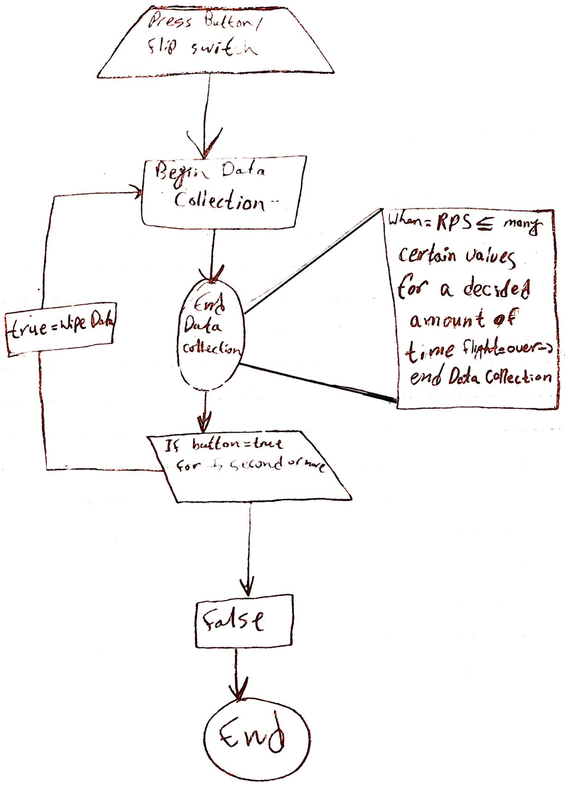
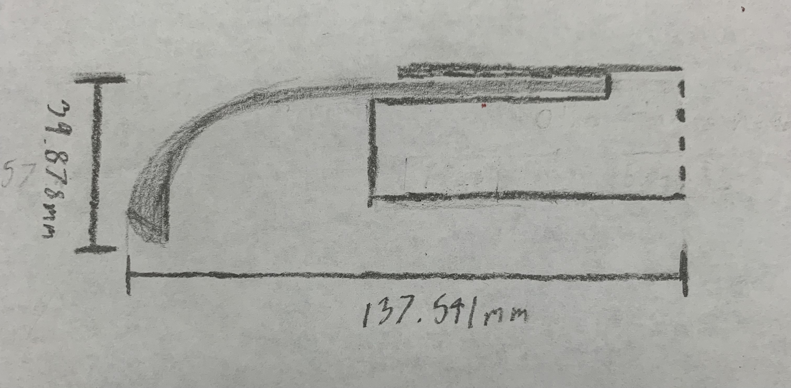

# Planning

## Table of Content
* [Brainstorming](#brainstorming)
* [Potential Design](#potential-designs)
* [Functionality](#functionality)
   * [Sample Code](block-diagram/sample-code)
* [Materials](#materials)
* [Have to learn](#what-do-we-need-to-learn)
* [What is success](#what-is-success-for-our-project)
   * [Safety](#safety)
* [Schedule](#schedule)
* [Images](#images) 

 
 

### Brainstorming
Using a gryoscope and a pico to measure the difference in rotation speed between the **backhand** throw and **forehand** throw to see which one might *spin* **faster**. We could also make the *mount* able to **attach** other kinds of frisbees like *frisbee golf discs* to see how much **faster** those might **spin** then the **normal frisbee**. Using the **gryoscope** we can measure *angular velocity*, but also measure the **acceleration** in all three directions(x, y, z). Being able to measure these gives us the ability to back track and measure x y and z velocities to tell us how **fast** its going in those directions, and also possible measure **displacement** *instead* of using a GPS module, but could be prone to having miscalculations. We were thinking that the **best** way to mount all of this stuff to a frisbee **without** altering the data would be to mount it to the **bottom** of the frisbee and make it **thin enough** that it wont stick out from the overhang that the frisbee already has.

 
 

### Potential Designs

* Helix on both the pod and frisbee so that they can screw together and are tightly secured
* Velcro the pod to the frisbee to allow modular use and being able to detach the pod.
* Use double sided adhesive to attach the pod to the frisbee
* 3D printed frisbee with personal modifications so that attaching the pod is simple, but resembles a comercial frisbee.
* Bolt pod to bottom of frisbee potentially adding more drag and air resistance, but is simple.
* Attach pod through the bottom of frisbee by cutting a square hole through frisbee, square so the pod wont rotate on it own, and attach cover plate so it is more aerodynamic then that of the bolt idea.
* Build both pod and frisbee in CAD as a singular unit so that we can make more modifications to the frisbee.

 
 

### Functionality
Pod attaches to frisbee somehow, ideas on how above, and in the pod there is a Pico, a gryoscope, powerboost module, and a Lipo Battery. With those components we would be able to measure angular velocity of how fast the frisbee is rotating.

  * #### Block diagrams/Sample Code
    

 
 

### Materials 

* Frisbees x amount
* Pico
* Accelerometer 
* PowerBoost Module
* 3.7 volt Lipo Battery
* Printed Pod 
* Bolts (Potentially)
* Velcro (Potentially)
* Double-Sided Tape (Potentially)
* A human arm to throw frisbee

 
 

### What Do We Need To Learn

* Remember how to use the accelerometer and use the gryoscope aspect. 
* How to add Helixes and use them correctly
* Learn which of our ideas above would work best.
* How to use CFD Simscale on our specifc piece
* How we could design opur own frisbee, and what is needed for each one.

 
 

### What is Success For Our Project
Making the frisbee collect the data in multiple ways, while showing the difference between the angular velocities of each throw. 

  * #### Safety 

      * Make sure to test in large field
      * Make sure field is clear before testing
      * Make sure that pod is fully secured and doesnt come detached in air
      * Make sure frisbee is thrown by someone with expierence

 
 

## Schedule

Achievement   |   Date  |
------------- |-------- |
Proposal Finished | Week 1 |
Research and Prototyping | Week 2 & 3 |
Finalize Idea | Week 4 |
Begin Code And Wiring | Week 5 & 6 |
Begin CAD And Manufactoring | Week 7 & 8 |
Begin Assembly and Testing | Week 9 & 10 |
Final Testing | Week 11 & 12 |
Small Iterations | Week 13 & 14 |
Documentation | Week 1-15 |

 
 

### Images

 
 

# [BACK TO TOP](#planning)
