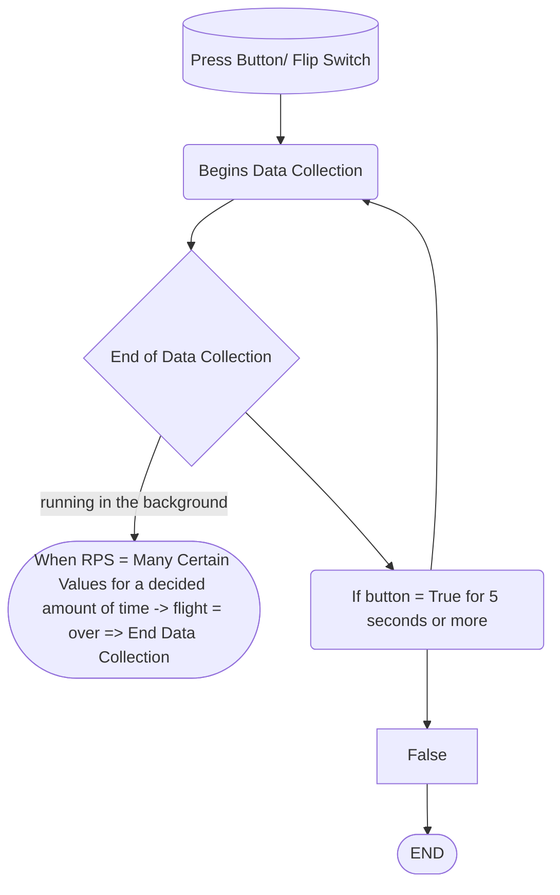

# Frisbee_Measure_Project

Using this repository as a documentation place for the Frisbee Measure Project

 <br>
 
 ---
 
 <br>
 
 ## Table of Content
 
 * [Timeline](#timeline-weekly)
 
 * [Images](#progress-images)
 
 * [CAD Designs](#cad-designs)
 
 * [CODE](#code)
 
<br>
<br>

---

<br>
<br>


### Iterations

<br>

* How our module might look with the Frisbee


<br>

* Psuedocoding of our module and how the code will look.




<br>
<br>

---

<br>
<br>


### Timeline (weekly)

<details><summary>CLICK ME</summary>
<p>

* **01/09/2023** =  completed the wiring circuit for collecting data and making the data collector be powered without any cable connection.

* **01/17/2023** =  Finished CAD Designs of the **enclousure** and placed them for printing.

   * **01/19/2023** = the printed designs were finished but were incorrect. The **enclousure**turned out to be short for the whole circuit, so all the measurements were fixed and checked, and the new enclousure was placed for printing.

* **01/23/23** = the new enclosure is printed, and began sanding edges and gaps to prevent collisions.

* **01/30/23** = By the end of this week, the module (**circuit** and **enclosure**) will be completed.

   * **02/06/23**  = Will find center of mass, and mount module, and mostly likely the first test launch will take place.
   
   * **02/02/2023** = **TimeLine** shortened by ** 1 week** as the **Center of Mass**, **Mounting the Module** on the **Frisbee** *AND* taking a **test launch** completed. A small cut out is incorporated to get access to the power switch as it was inaccessible before.
   
   * **02/03/23** = A small cutout made in the enclosure is made to grant access to the power switch inside. 
   
* **02/06/23** = Testing to see if the module collects data and stores it when thrown most likely multiple times. 

   * **02/07/23** = Starting to write **new code** for **GPS**.
   
   
   
<br>

### [BACK TO TimeLine](#timeline-weekly)

   
</p>
</details>

<br>
<br>

---

<br>
<br>


<br>

### Progress Images

<br>

<details><summary>CLICK ME</summary>
<p>

<br>

* Video of the **Gyroscope** working.

.gif)

<br>

* The circuit, completed and working.


<br>

* The circuit and the enclosure completed and assemble.


<br>

* The first test launch of the Module mounted, but **NOT** collecting **Data**.


<br>

* A cutout was made separatly so that we can get access to the power switch **inside** the enclosure.


<br>

* Ran two test runs that collected data and stored them in a CSV file.


<br>
<br>

### [BACK TO Progress Images](#progress-images)

</p>
</details>

<br>
<br>

---

<br>
<br>

### CAD Designs

<details><summary>CLICK ME</summary>
<p>

**Description:** All the designs and iterations completed to get a virtual visual of the final build are present in the OnShape Document.

<br>

Link to the [Onshape](https://cvilleschools.onshape.com/documents/8f23dd08753053fddae2e327/w/56d5ad7e3900473835bb5009/e/42cb564d32431f5d8d36b7a9) Document.

<br>

* The completed CAD version of the **enclosure** and **circuit**


<br>

---

<br>


<details><summary>CIRCUIT</summary>
<p>

<br>

* The Circuit was completed in **ONSHAPE** to be used as a model for making an **enclosure** that the Circuit would be placed in.


</p>
</details>

<br>
<br>

---

<br>
<br>

<details><summary>Frisbee</summary>
<p>

<br>

* The frisbee was imported from a public document, and then altered to fit our frisbee's dimentions as best as possible. The 


</p>
</details>


<br>
<br>

### [BACK TO CAD Designs](#cad-designs)

</p>
</details>

<br>
<br>

---

<br>
<br>

### CODE

<details><summary>CLICK ME</summary>
<p>

<br>

**Description:** All *iterations* and **methods** to make the circuit, functions as should are present. The code runs the **methods**, and collects the data recieved and puts them in a **CSV file** which displays the Angular velcoity and time in an excel sheet.

<br>

* A first iteration of the code which confirms that the pico is communicating with the MPU5060.

```python
```circuit_python

# type: ignore
import adafruit_mpu6050
import busio
import board
import time
import digitalio
#assigns the scl to GP6 and assigns sda to GP7 on the pico board
sda_pin = board.GP6
scl_pin = board.GP7
buttonPin = digitalio.DigitalInOut(board.GP17)
buttonPin.direction = digitalio.Direction.INPUT
buttonPin.pull = digitalio.Pull.DOWN 
i2c = busio.I2C(scl_pin, sda_pin)
mpu = adafruit_mpu6050.MPU6050(i2c)
counter = 0
list_x = []
list_y = []
list_z = []
timer = time.monotonic()
while buttonPin.value == True:
    pass
    print("PASSSSSSSSSSSSSSSSSSSSSSSSSSSSSSSSSSSSSS")
# button syntax still needed.
while True:
    x_angular_velocity = mpu.gyro[0]
    y_angular_velocity = mpu.gyro[1]
    z_angular_velocity = mpu.gyro[2]
    list_x = [list_x, x_angular_velocity]
    list_y = [list_y, y_angular_velocity]
    list_z = [list_z, z_angular_velocity]
    print(z_angular_velocity)


```

<br>
<br>

* This is the completed **code** for the Moduel, it **collects** the *data*, stores it in a CSV file, incorporates the button function where the module won't collect data as long as the button is held (**button value = false**).

```python
```circuit_python

# type: ignore
import adafruit_mpu6050
import busio
import board
import time
import digitalio
import math
#assigns the scl to GP6 and assigns sda to GP7 on the pico board
sda_pin = board.GP6
scl_pin = board.GP7
buttonPin = digitalio.DigitalInOut(board.GP17)
buttonPin.direction = digitalio.Direction.INPUT
buttonPin.pull = digitalio.Pull.UP 
i2c = busio.I2C(scl_pin, sda_pin)
mpu = adafruit_mpu6050.MPU6050(i2c)
mpu.gyro_range = 3
counter = 0
list_x = []
list_y = []
list_z = []
list_time = []
while buttonPin.value == False:
    pass
    #print("Pass")
timer = time.monotonic()
while True:
    x_angular_velocity = mpu.gyro[0]
    y_angular_velocity = mpu.gyro[1]
    z_angular_velocity = mpu.gyro[2]
    list_x = [list_x, x_angular_velocity]
    list_y = [list_y, y_angular_velocity]
    list_z.append(z_angular_velocity)
    list_time.append(time.monotonic())
    #print(z_angular_velocity)
    current_time = time.monotonic() - timer
    if current_time > 2 and math.fabs(mpu.gyro[0]+mpu.gyro[1]+mpu.gyro[2])<1:
        break
#break out of while true and save data
Values=open(f"/data/{time.monotonic()}.csv","w")
for i in range(len(list_z)):
    Values.write(f"{list_time[i]}{list_z[i]}\n")
Values.close


```


<br>
<br>

### [BACK TO Code](#code)


</p>
</details>

<br>

<br>
<br>

---

<br>
<br>

# [BACK TO TOP](#frisbee_measure_project)
