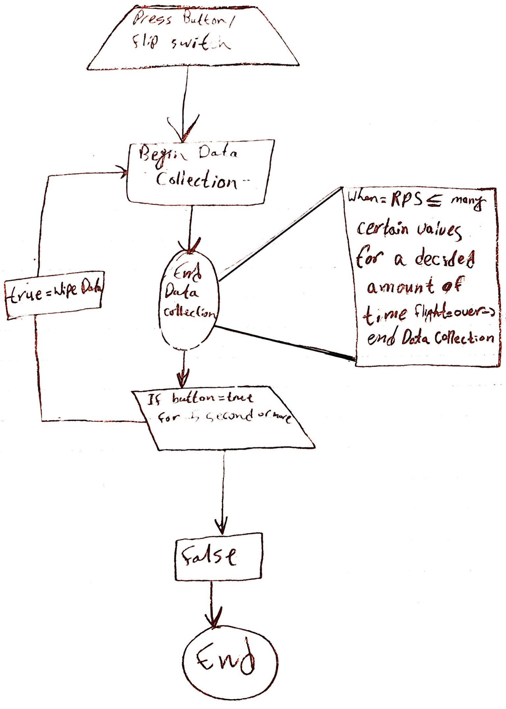

# Frisbee_Measure_Project

Using this repository as a documentation place for the Frisbee Measure Project

  
 
 ---
 
  
 
 ## Table of Content
 
 * [Timeline](#timeline-weekly)
 
 * [Images](#progress-images)
 
 * [CAD Designs](#cad-designs)
 
 
 

---

 

### Timeline (weekly)

* **01/09/2023** =  completed the wiring circuit for collecting data and making the data collector be powered without any cable connection.

* **01/17/2023** =  Finished CAD Designs of the **enclousure** and placed them for printing.

   * **01/19/2023** = the printed designs were finished but were incorrect. The **enclousure** was too short for the whole circuit, so all the measurements were fixed and checked, and the new enclousure was placed for printing.

* **01/23/23** = the new enclosure is printed

* **01/30/23** = By the end of this week, the module (**circuit** and **enclosure**) will be completed

   * **02/06/23**  = Will find center of mass, and mount module, and mostly likely the first test launch will take place.
   
   * **02/02/2023** = **TimeLine** shortened by ** 1 week** as the **Center of Mass**, **Mounting the Module** on the **Frisbee** *AND* taking a **test launch** completed.
   

 
 

---

 

### Progress Images

 

* How our module might look with the Frisbee

 

* Psuedocoding of our module and how the code will look.

 

* Video of the **Gyroscope** working.

.gif)

 

* The circuit, completed and working.

 

* The circuit and the enclosure completed and assemble.

 

* The first test launch of the Module mounted, but **NOT** collecting **Data**.

### CAD Designs

**Description:** All the designs and iterations completed to get a virtual visual of the final build are present in the OnShape Document.

 

Link to the [Onshape](https://cvilleschools.onshape.com/documents/8f23dd08753053fddae2e327/w/56d5ad7e3900473835bb5009/e/42cb564d32431f5d8d36b7a9) Document.

 

* The completed CAD version of the **enclosure** and **circuit**

 
 

---

 

# [BACK TO TOP](#frisbee_measure_project)
